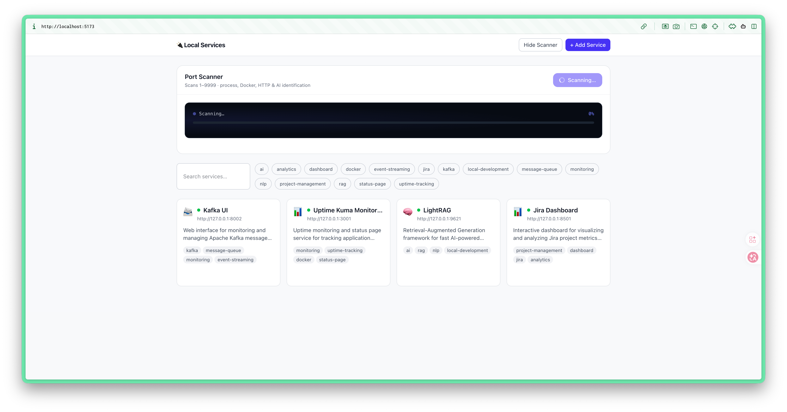
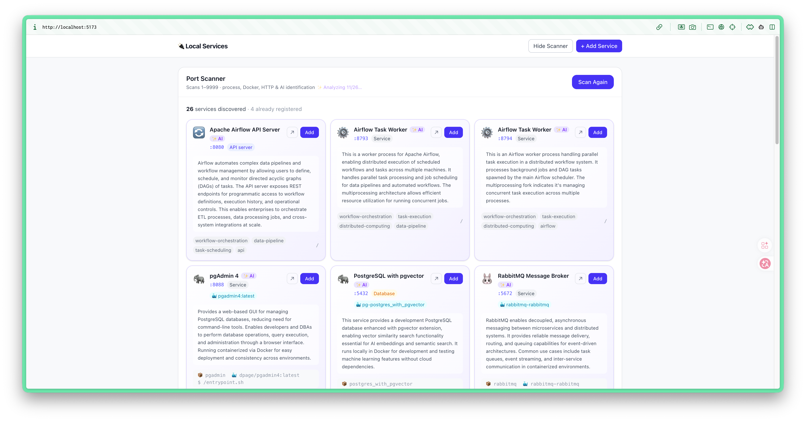

# Local Service Dashboard

A local navigation hub for all your running services.



 Scans open ports, identifies what's running (processes, Docker containers, HTTP fingerprinting), and optionally enriches results with Claude AI. Exposes an MCP server so AI assistants can discover and manage your local environment.

## Features

- **Two-phase port scan** — scans 3000–9999 + known infra ports first and shows results immediately; continues 1–2999 in the background
- **Process identification** — resolves the owning process, working directory, git repo name, and env vars for each open port
- **Docker support** — runs `docker ps` / `docker inspect` to identify container images, Compose project/service names, env vars, and labels
- **HTTP probing** — fetches each HTTP port, extracts the page title, and fingerprints the framework (Next.js, Vite, Nuxt, Astro, Remix, Grafana, Kibana, etc.)
- **AI enrichment** — sends process + Docker + HTTP context to Claude for a one-line business description; runs automatically after scan completes (requires API key)
- **Service registry** — manually add, edit, and delete services; persisted in SQLite at `~/.local/share/local-service-dashboard/services.db`
- **Health checks** — periodically pings each registered service and shows online/offline status
- **MCP server** — exposes `list_services`, `add_service`, `remove_service`, `scan_ports`, and `get_local_environment` tools for AI assistants

## Tech Stack

| Layer | Technology |
|-------|-----------|
| Runtime | [Bun](https://bun.sh) ≥ 1.0 |
| Backend | [Hono](https://hono.dev) + bun:sqlite |
| Frontend | React 19 + Vite + TailwindCSS v4 |
| AI | Anthropic Claude (`claude-haiku-4-5`) via `@anthropic-ai/sdk` |
| MCP | `@modelcontextprotocol/sdk` |
| Monorepo | Bun workspaces |

## Quick Start

```bash
# Install dependencies (requires Bun ≥ 1.0)
bun install

# Start backend + frontend together
bun dev
```

- Frontend: http://localhost:5173
- Backend API: http://localhost:3737
- MCP HTTP endpoint: http://localhost:3737/mcp

## Environment Variables

Create `packages/backend/.env` (or set in your shell):

```env
# Required for AI enrichment
ANTHROPIC_API_KEY=sk-ant-...

# Optional: custom base URL (proxy, local model, etc.)
ANTHROPIC_BASE_URL=https://your-proxy.example.com
```

If `ANTHROPIC_API_KEY` is not set, the AI enrichment button is hidden and the scan works purely with heuristic rules.

## MCP Integration

### Claude Desktop (stdio mode)

Add to `~/Library/Application Support/Claude/claude_desktop_config.json`:

```json
{
  "mcpServers": {
    "local-dashboard": {
      "command": "bun",
      "args": [
        "run",
        "/absolute/path/to/local-service-dashbard/packages/backend/src/index.ts",
        "--mcp-stdio"
      ],
      "env": {
        "ANTHROPIC_API_KEY": "sk-ant-..."
      }
    }
  }
}
```

Replace the path with the actual location of your clone.

### HTTP/SSE mode

If the backend is already running, any MCP client can connect to:

```
http://127.0.0.1:3737/mcp
```

### Available MCP Tools

| Tool | Description |
|------|-------------|
| `list_services` | List all registered services |
| `add_service` | Add a new service to the registry |
| `remove_service` | Remove a service by ID |
| `scan_ports` | Trigger a port scan and return discovered services |
| `get_local_environment` | Summary of the local dev environment |

## Project Structure

```
packages/
├── shared/          # Shared TypeScript types (ServiceEntry, ScannedPort, ScanTask, …)
├── backend/
│   └── src/
│       ├── index.ts             # Entry point — HTTP API + optional MCP stdio
│       ├── scanRouter.ts        # POST /api/scan  ·  GET /api/scan/:id  ·  POST /api/scan/analyze
│       ├── servicesRouter.ts    # CRUD  /api/services
│       ├── portScanner.ts       # Two-phase TCP scan with partial results
│       ├── processResolver.ts   # lsof → process info, cwd, git remote, env vars
│       ├── dockerResolver.ts    # docker ps + docker inspect → container identity
│       ├── httpProbe.ts         # HTTP fetch + framework fingerprinting
│       ├── inferService.ts      # Rule-based service identification (port + process + HTTP + Docker)
│       ├── aiEnricher.ts        # Claude API — generates name, tags, business context
│       ├── projectReader.ts     # Reads README / package.json / .env keys for AI context
│       ├── serviceRepository.ts # SQLite CRUD
│       ├── mcpServer.ts         # MCP tool & resource definitions
│       └── healthChecker.ts     # Periodic service health checks
└── frontend/
    └── src/
        ├── App.tsx
        ├── api.ts               # API client
        └── components/
            ├── ScanPanel.tsx    # Animated scan visualizer + priority-sorted service cards
            ├── ServiceCard.tsx
            ├── ServiceFormModal.tsx
            └── EmptyState.tsx
```

## Development

```bash
# Backend only (port 3737, hot-reload)
bun run --filter './packages/backend' dev

# Frontend only (port 5173, HMR)
bun run --filter './packages/frontend' dev
```

> **Security note**: The dashboard binds only to `127.0.0.1` and has no authentication. Do not expose it to a network.

## License

MIT
